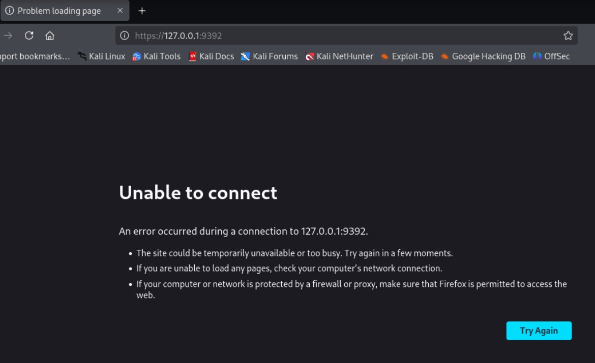
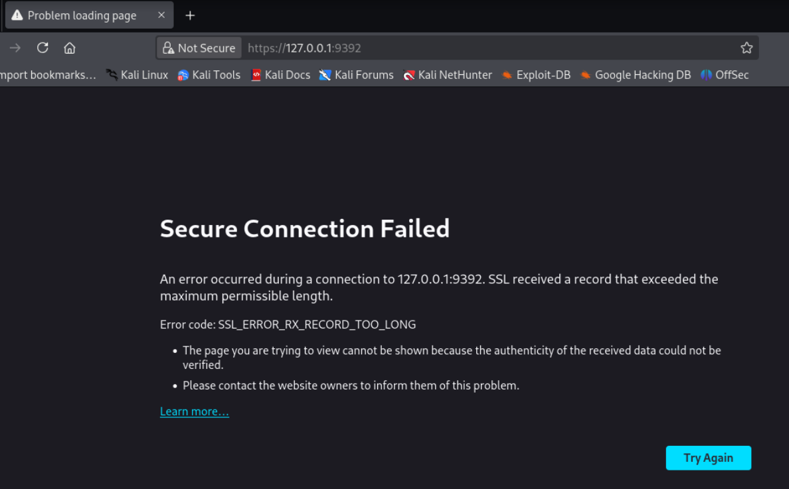
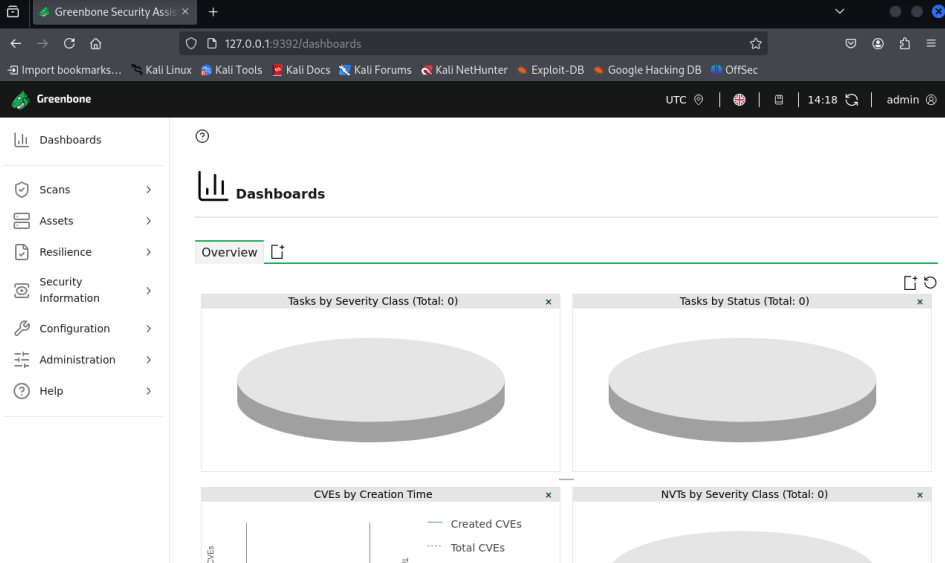
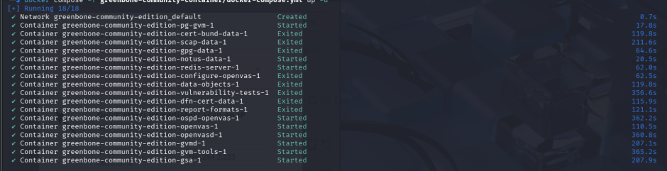
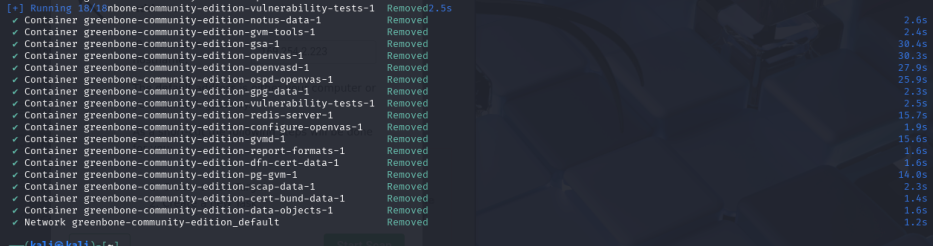
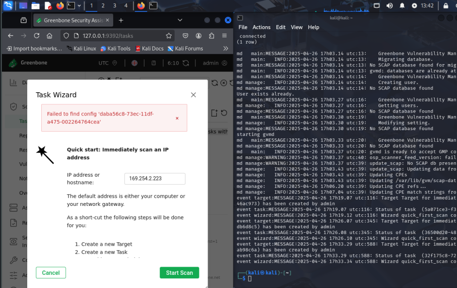
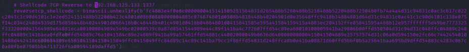
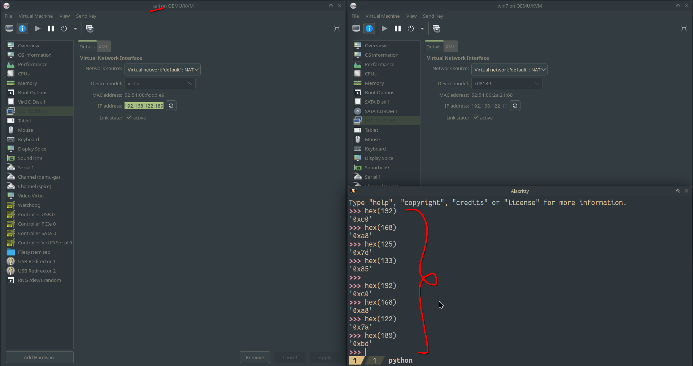
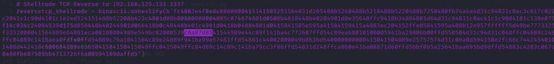
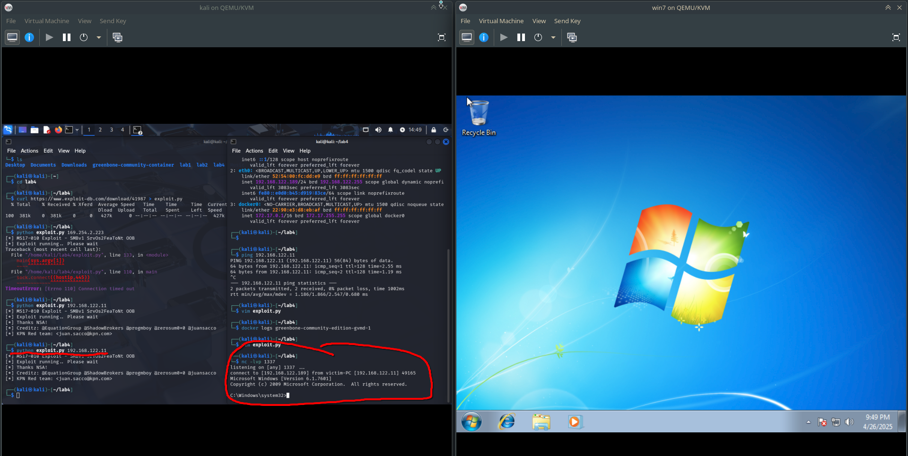

OpenVas instructions that were given lead to the following:

I do the steps one by one

...

`gvm-setup` works

`gvm-check-setup` says:

```
ERROR: SCAP DATA are missing.
        FIX: Run the SCAP synchronization script greenbone-feed-sync.
        sudo greenbone-feed-sync --type scap
```

This command does its job (ends successfully)

`gvm-check-setup` says the same thing that SCAP is missing

Internet (when asked about this problem) says not to believe what script is saying, because it is not official (wow), and instead check the web interface

I skip to the next step of `gvm-start` - it says it started the UI... BUT IT DIDN'T:



After spending an hour trying to debug (including turning the VM off and on, of course), I asked my friend and he said that the tutorial provided to us does not work and he spent 5 hours with no success - GREAT

He said the dockerized version worked for him - this is what I tried next. After waiting a dozen more minutes for docker to download all the images and start them, It launched. But...



The documentation said to open https explicitly. And it's not the issue of the certificate not being signed with a known key... It's a completely broken record with a bizzare length (I hope this openvas didn't just hack my browser with some buffer overflow)

Fortunately, http still works ^-^

Now I log in with my credentials:



I just have to go to scans and start a new one! Except that "Failed to find config 'daba56c8-73ec-11df-a475-002264764cea'"

The internet says I need to update the feed. I updated the docker images (it should update the feed acording to the documentation) and restarted the containers (which should sync the feed automatically).

Now it does not log in... I restart containers again, and at least I can log in. For a second the dashboard says it is syncing the changes, but it quickly disappeared - great!

I thought until I GOT THE SAME MESSAGE that it failed to find the config.

At this point I got desparate, because I already tried a bunch of stuff (some completely did not work and I did not include in this report). Each RESTART of the openvas took approximately **15 MINUTES**. Each. One. It's already with almost all resources dedicated to Kali VM. So I already spent like **6 HOURS** on the task unsuccessfully tried to make openvas work, and it was draining the last bits of me. Here is proof of how long it takes to start and stop:





After 6 hours of grinding, I still got a bunch of warnings in the logs, and I was too exhausted to try and find, which of them (and if any??) was causing this weird behaviour:

```
...
md manage:WARNING:2025-04-26 17h03.37 utc:40: osp_scanner_feed_version: failed to connect to /run/ospd/ospd-openvas.sock
md manage:WARNING:2025-04-26 17h03.37 utc:39: update_scap: No SCAP db present, rebuilding SCAP db from scratch
...
OSPD[7] 2025-04-26 17:06:16,091: INFO: (ospd_openvas.daemon) Loading VTs. Scans will be [requested|queued] until VTs are loaded. This may take a few minutes, please wait...
...
event wizard:MESSAGE:2025-04-26 17h19.12 utc:116: Wizard quick_first_scan could not be run by admin
...
OSPD[7] 2025-04-26 17:28:00,540: INFO: (ospd_openvas.daemon) Finished loading VTs. The VT cache has been updated from version 0 to 202504251648.
...
event wizard:MESSAGE:2025-04-26 17h33.34 utc:588: Wizard quick_first_scan could not be run by admin
```

Even after finished VT update, the wizard still couldn't do this misterious `quick_first_scan` - perhaps it's not the synchronization issue or perhaps I just need to wait for another 30? 60? 120? minutes. My friend told me synchronization for him took an hour or so, and his PC specs are definitely much better than mine.

Waiting for so long after each change, some random stuff happening, the official tutorial, which was provided to us, not working and long hours of trying desparately convinced me that trying for another $\mathcal{N}(4, 2)$ hours (normal distribution with mean at 4 and standard deviation at 2) was just not worth it.

So here are a few pictures that show other stuff I did:

Windows 7 (I also figured out with time that Windows 7 does not work with the default e1000e VM network device model, and I needed to change it to rtl8139 - at least I did not waste a few hours on this quirk; the time wasted was measured in minutes):


Kali:



The CVE in question seems to be CVE 2017-0145 - a vulnerability in Microsoft SMB v1 (a protocol to share files, printers and some other communication on a network), and in the srv.sys driver specifically. There is little to no info on the internet about the specifics, but looking at some exploitation code examples it seems that the issue is once again using the buffer overflow (the application does not have adequate boundary checks). The code receives two ints, reinterprets them as pointers and does memmove, but does not check that memmove does not write outside of the bounds. As it is kernel code we are talking about, after the buffer overflow shenanigans, we should get kernel level code execution.

There is this code in one of the exploits from the intenet (I took it from here: https://www.exploit-db.com/download/41987):



So I need to change to my IP address in hex:



(I don't want to provide code itself, because it is basically unchanged, and I don't want to have troubles with licenses etc.)

Here it is:



Now I just change the values to mine (0xc0a87abd). Now I just run the exploit:



Yay! Now I can do whatever I want there.
